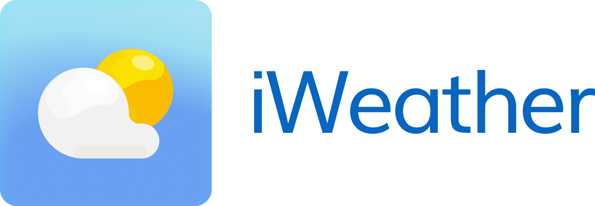
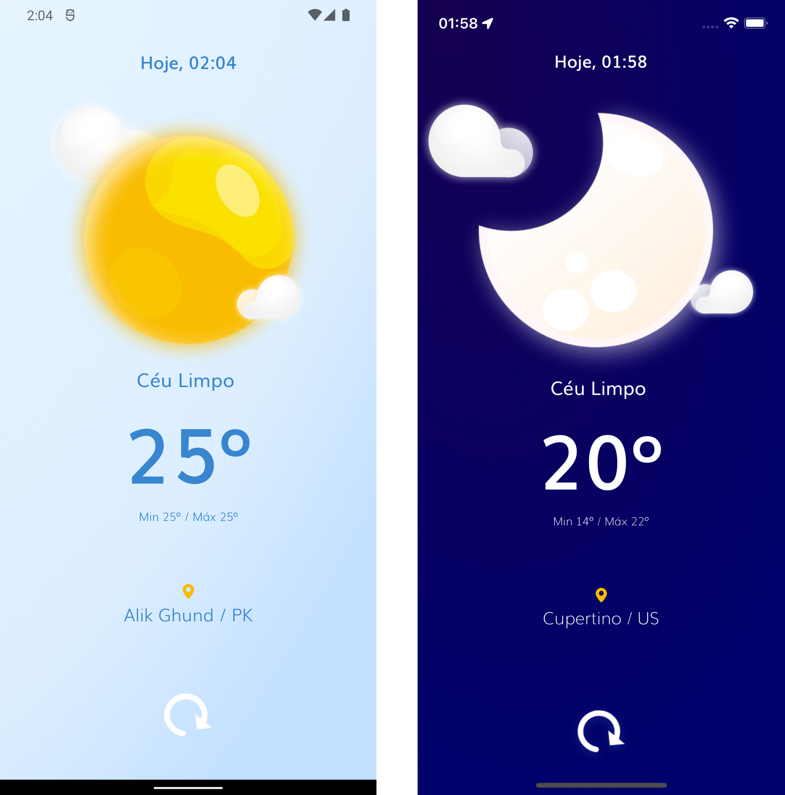

# :cloud: iWeather App

<p align="center">
  
</p>
<br/>

# :partly_sunny: Versão 1.0

## :iphone: Telas

<p align="center">
  
</p>

#

## :tech: Tecnologias e Detalhes

- React Native (template com TS)
- TypeScript
- React Navigation 6
- Fonte Personalizada: [Muli](https://www.fontsquirrel.com/fonts/muli)
- React-native-svg para uso de gráficos SVG em alguns locais.
- Requisição de Permissões para iOS e Android com react-native-permissions (Location).
- Localização com react-native-geolocation-service.
- React-native-dotenv para ocultar minha chave de API (.env) coloque sua chave no .env.blank e renomeie para .env
- Organização das Pastas segundo suas funcionalidades para melhor Arquitetura e Manutenção.
- Projetei a Interface e usabilidade aproveitando conceitos da internet e melhorando.
- Axios para as requisições de API externas.
- Animações básicas com Animated API do react-native.
- Fazer todos os ícones para a duas plataformas e por ai vai, :)

To-do
- Adicionar Testes com Jest e Coverage
- Adicionar/Melhorar o handling de Error em tela para o usuário por exemplo para quando solicitado o Location e Timeout de API ou falha da requisição.
- Implementar um mapa via bottom-sheet para melhor visualização do seu local.
- Implementar mais informações sobre o clima da semana na interface.

#

## :art: Design e Conceito


Concebi o design do aplicativo, ícone do App e demais grafismo de interface a partir de designs de conceitos de Apps de Clima e Ícones de representação do tempo que consegui na internet e redesenhei baseado neles, fazendo as alterações necessárias para implementar toda a gama de ícones base do [OpenWeatherMap](https://openweathermap.org/weather-conditions#Weather-Condition-Codes-2).

Acrescentei umas pequenas animações para dar mais dinâmica ao App devido os aplicativo de climas serem bem estáticos. 

Iniciei o desenvolvimento implementando a checagem e handling das permissões no iOS e Android, requisitei-as quando previsto e informei ao usuário na interface que precisaria delas e por que, não chamei direto para poder ficar mais claro ao usuário.

Permitidas as solicitações, procedi pegando localização do aparelho, tento sucesso procedo consultando a API do OpenWeatherMap e informo os principais dados do clima na tela para aquela localidade. 

Tracei a meta de gastar 28 horas de desenvolvimento em 7 dias desenvolvendo e ver o que iria consequir.

#
## Quick Start

Para clonar e rodar o App no seu computador

```sh
git clone https://github.com/ewertonfragoso/iweather.git your-app-name
```
Depois de clonado, configurar o .env.blank com sua chave do OpenWeaterMap.org e renomear para .env em seguida rodar normalmente o projeto se tiver o ambiente de simualdores.

- `yarn install`
- `cd ios && pod install`
- `cd .. && yarn android/ios`
#

## Autor

Ewerton Fragoso, ewertonfragoso@g---l.com

## Licença

iWeathet is available under the MIT license. See the LICENSE file for more info.


